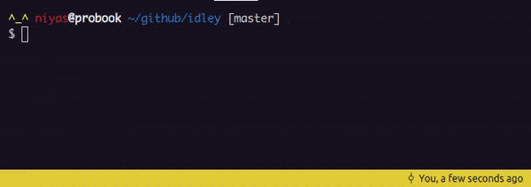

# IDLEy
_A bare minimal Python IDLE_

 

# What's included
- [x] Single line expressions
- [x] `eval` and `exec`
- [x] Error handling
- [x] Maintian global state
- [x] Save global state
- [x] Pretty colors
- [ ] Multi line context
- [ ] Live variable inspector

# But why?
- Learn what goes on behind the scenes
- Understand what `eval` and `exec` does and when to use them
- Learn to refactor code as things get complicated